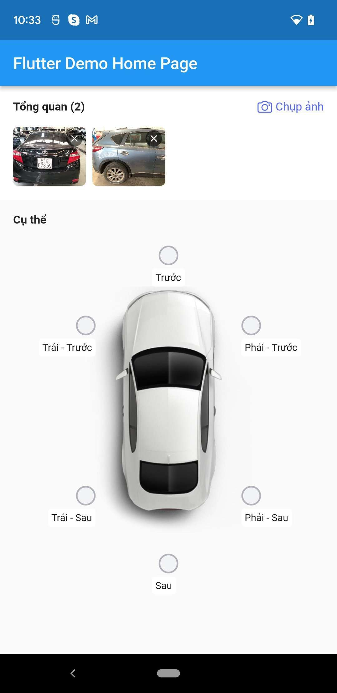
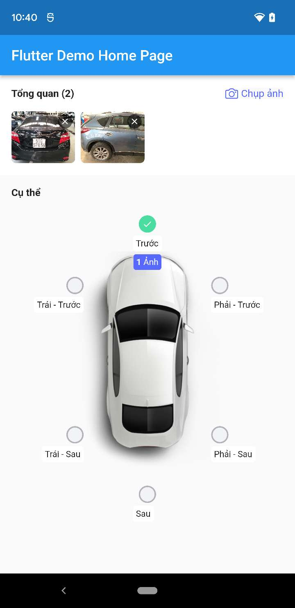
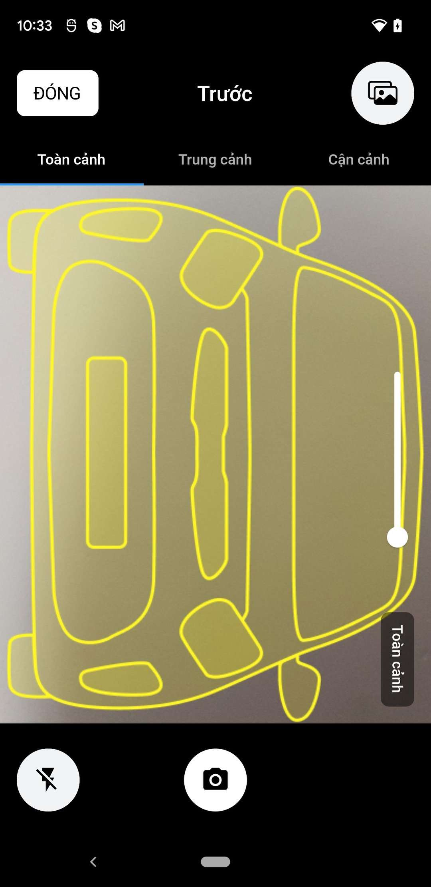
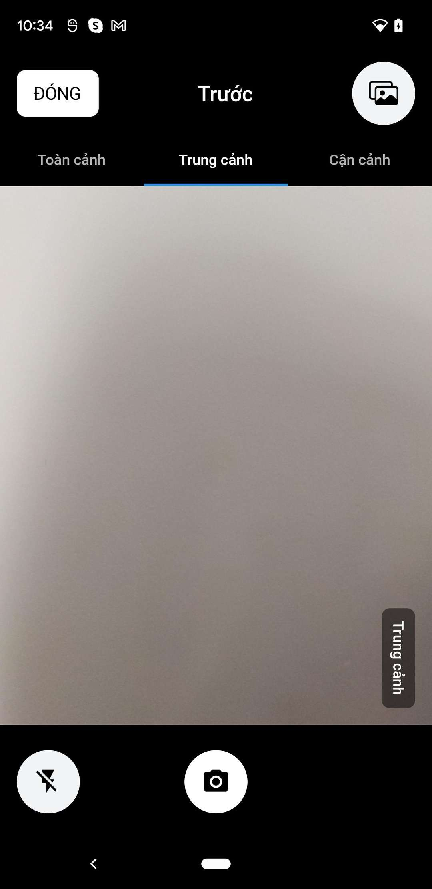

# aicycle_insurance_plugin

## 🚀&nbsp; Overview

Flutter plugin to add AICycle Insurance Widget inside your project.

### Set permissions
   - **iOS** add these on ```ios/Runner/Info.plist``` file

```xml
<key>NSCameraUsageDescription</key>
<string>Your own description</string>

<key>NSMicrophoneUsageDescription</key>
<string>Your own description</string>

<key>NSPhotoLibraryUsageDescription</key>
<string>Your own description</string>
```

  - **Android**
    - Set permissions before ```<application>```
    <br />

    ```xml
    <uses-permission android:name="android.permission.CAMERA" />
    <uses-permission android:name="android.permission.WRITE_EXTERNAL_STORAGE" />
    <uses-permission android:name="android.permission.ACCESS_MEDIA_LOCATION" />
    ```

    - Change the minimum SDK version to 21 (or higher) in ```android/app/build.gradle```
    <br />

    ```
    minSdkVersion 21
    ```
### Screenshots
- **Claim Folder Page**



- **Camera View**




- **Preview Image Page**

### Import the package
```dart
import 'package:aicycle_insurance/aicycle_insurance.dart';
```
